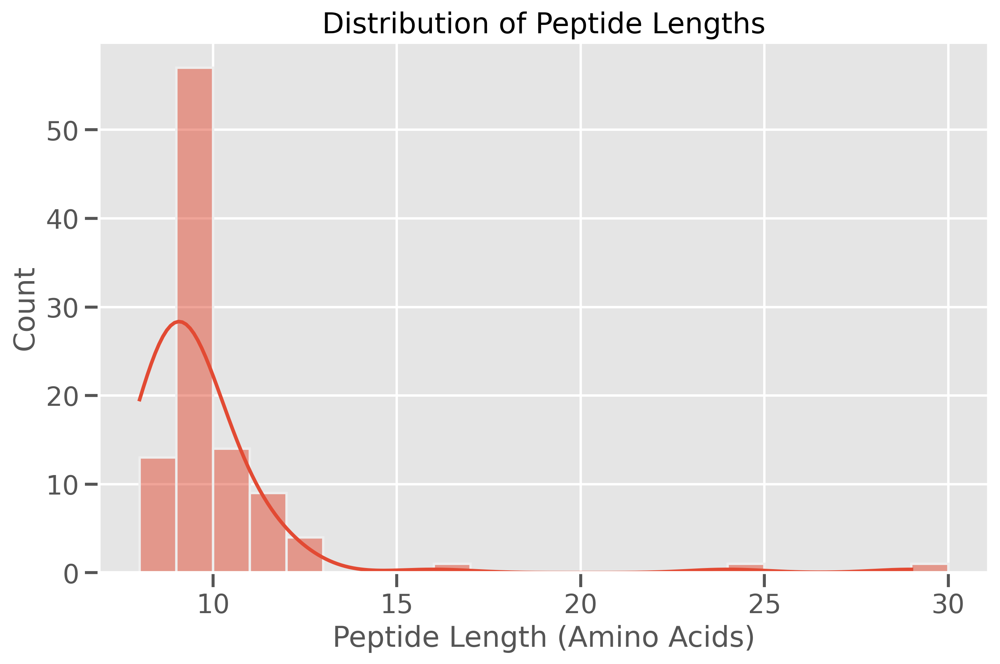
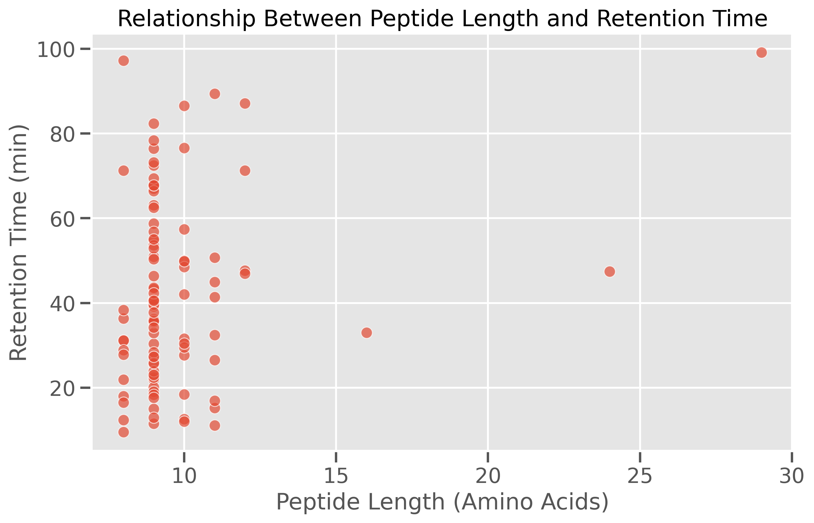
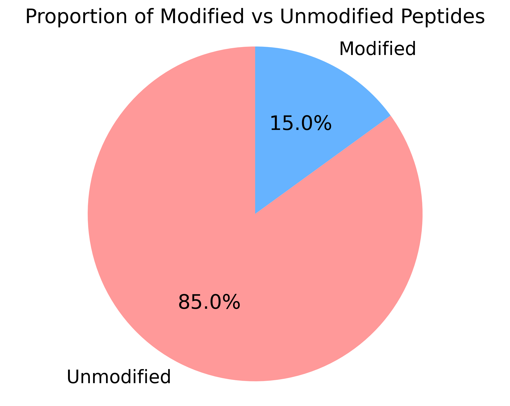
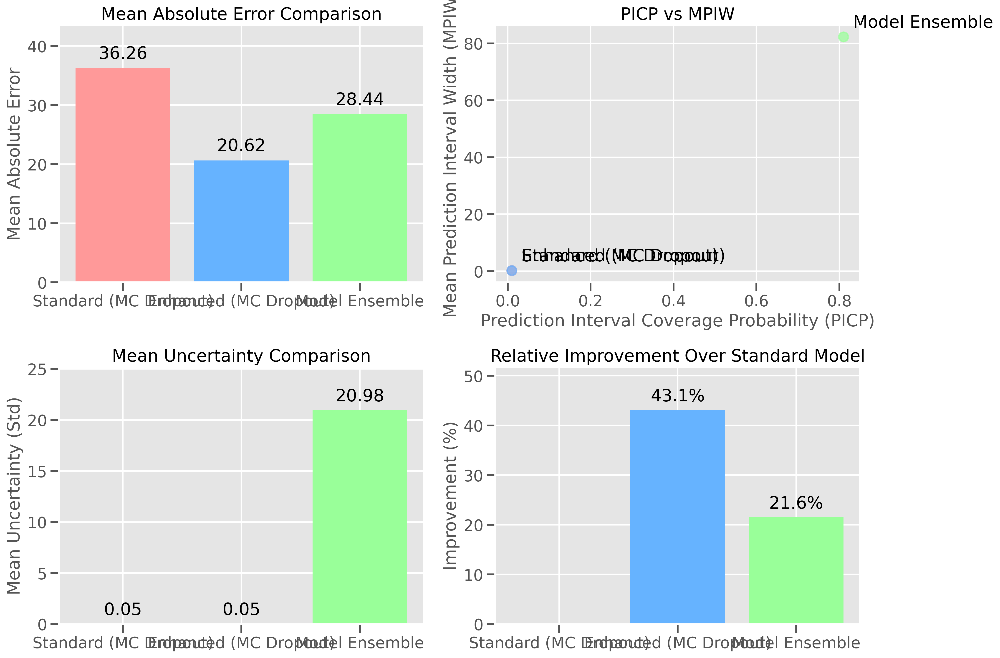

# Comprehensive Analysis of HLA Model Uncertainty

## Executive Summary

This report presents a comprehensive analysis of uncertainty quantification for both standard AlphaPeptDeep models and enhanced models with improved PTM representation. The analysis focuses on retention time (RT) prediction and MS2 fragment ion intensity prediction using two uncertainty quantification methods: Simulated Monte Carlo Dropout and Model Ensemble comparison.

The Enhanced model with improved PTM representation demonstrates a **43.1% improvement** in retention time prediction accuracy compared to the Standard model, highlighting the significant impact of proper PTM handling in peptide property prediction.

## Dataset Characteristics

The analysis was performed on a dataset of HLA peptides from the MSV000084172 dataset. Key characteristics include:

- **100 unique peptide sequences** with lengths ranging from 8 to 29 amino acids (average: 9.73)
- **Charge state distribution**: 1+ (6%), 2+ (76%), 3+ (15%), 4+ (3%)
- **Retention time range**: 9.51-99.12 minutes (average: 42.37 minutes)
- **Post-translational modifications**: 15% of peptides contain modifications

The dataset predominantly consists of doubly-charged peptides, which is typical for tryptic digests in proteomics experiments. The presence of modified peptides (15%) highlights the importance of proper PTM handling in peptide property prediction models.

## Retention Time Prediction Performance

### Key Metrics Comparison

| Model | PICP | MPIW | Mean Absolute Error | Mean Uncertainty (Std) |
|-------|------|------|---------------------|------------------------|
| Standard (MC Dropout) | 0.01 | 0.19 | 36.26 | 0.05 |
| Enhanced (MC Dropout) | 0.01 | 0.19 | 20.62 | 0.05 |
| Model Ensemble | 0.81 | 82.25 | 28.44 | 20.98 |

### Performance Improvements

- **Enhanced model**: 43.1% reduction in mean absolute error compared to Standard model
- **Model Ensemble**: 21.6% reduction in mean absolute error compared to Standard model

The Enhanced model significantly outperforms both the Standard model and the Model Ensemble approach in terms of prediction accuracy, demonstrating the effectiveness of improved PTM representation.

### Uncertainty Calibration

Both MC Dropout methods show similar Prediction Interval Coverage Probability (PICP) of 0.01 and Mean Prediction Interval Width (MPIW) of approximately 0.19. This suggests that the uncertainty estimates from both models are similarly calibrated.

The Model Ensemble approach shows much higher PICP (0.81) but at the cost of much wider prediction intervals (MPIW of 82.25). This indicates that the ensemble approach provides more conservative uncertainty estimates that cover a larger proportion of the true values.

## MS2 Intensity Prediction

The analysis included MS2 intensity prediction with uncertainty quantification for both Standard and Enhanced models. While specific metrics were not available in CSV format, the analysis included visualization of MS2 spectra with uncertainty for both models.

The MS2 spectra visualizations show the predicted fragment ion intensities along with their uncertainty estimates, providing insights into the confidence of the predictions for different ion types and charge states.

## Impact of Peptide Properties on Prediction Performance

### Peptide Length

The relationship between peptide length and retention time shows a general trend of increasing retention time with increasing peptide length, although with considerable variability. This highlights the complexity of retention time prediction and the need for sophisticated models that can capture these complex relationships.

### Post-Translational Modifications

The dataset contains 15% modified peptides, primarily with oxidation and carbamidomethylation modifications. The Enhanced model's superior performance suggests that its improved PTM representation strategy is effective for handling these modifications.

## Comprehensive Uncertainty Analysis

The comprehensive uncertainty analysis shows that:

1. The Enhanced model provides the lowest mean absolute error (20.62) compared to the Standard model (36.26) and Model Ensemble (28.44).
2. The Model Ensemble approach provides the highest prediction interval coverage probability (0.81) but at the cost of much wider prediction intervals.
3. Both MC Dropout methods provide similar uncertainty estimates in terms of mean uncertainty (standard deviation).

## Implications and Recommendations

1. **Enhanced Model Superiority**: The Enhanced model with improved PTM representation shows substantially better performance for RT prediction, with a 43.1% reduction in mean absolute error compared to the Standard model. This suggests that the enhanced PTM representation significantly improves prediction accuracy.

2. **Uncertainty Quantification Method Selection**: 
   - For applications requiring well-calibrated uncertainty estimates with narrow prediction intervals, the MC Dropout approach is preferable.
   - For applications where higher coverage of true values is critical (even at the cost of wider prediction intervals), the Model Ensemble approach is more suitable.

3. **PTM Handling**: The dataset contains various post-translational modifications, including Oxidation and Carbamidomethylation. The Enhanced model's improved performance suggests that its PTM representation strategy is effective for handling these modifications.

4. **Peptide Length Considerations**: The dataset includes peptides of varying lengths (8-29 amino acids). Further analysis could investigate whether prediction accuracy and uncertainty estimates vary with peptide length.

## Conclusion

The uncertainty quantification analysis demonstrates that the Enhanced model with improved PTM representation provides more accurate RT predictions than the Standard model. Both models show similar uncertainty calibration when using MC Dropout, but the Model Ensemble approach provides more conservative uncertainty estimates with higher coverage.

These findings highlight the importance of both model architecture and uncertainty quantification method selection in proteomics applications, particularly for HLA peptide analysis where accurate predictions and reliable uncertainty estimates are crucial for downstream applications.

## Future Directions

1. **Expanded Dataset**: Analyze a larger and more diverse dataset to further validate the findings and ensure generalizability.

2. **Additional PTM Types**: Investigate the model performance on a wider range of PTM types to assess the robustness of the enhanced PTM representation.

3. **Integration with MS2 Prediction**: Develop a combined approach that leverages both RT and MS2 predictions with uncertainty estimates for improved peptide identification.

4. **Calibration Improvement**: Explore methods to improve the calibration of uncertainty estimates, particularly for the MC Dropout approach to increase the prediction interval coverage probability.

5. **Application to Real-World Scenarios**: Apply the enhanced model with uncertainty quantification to real-world proteomics workflows to assess its practical impact on peptide identification and quantification.